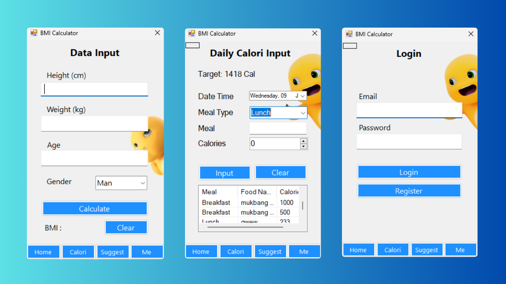

# BMI & Calorie Tracker WinForms App MVC

This is a desktop application built with **Windows Forms** and **.NET Framework 4.8** designed to help users calculate their Body Mass Index (BMI), track their daily caloric intake, and receive personalized health recommendations.

This project was developed as a student project for learning purposes. A key goal was to refactor the initial code from a single-class structure into a clean **Model-View-Controller (MVC)** architecture to improve code organization, scalability, and maintainability. The user interface is styled using the **Nailoong** custom theme components.

## Table of Contents

- [Application Mockup](#application-mockup)
- [Features](#features)
- [Project Structure](#project-structure)
- [Getting Started](#getting-started)
- [Dependencies](#dependencies)
- [Contributing](#contributing)
- [Me](#Me)
- [Acknowledgments](#acknowledgments)

## Application Mockup



## Features

This application includes a comprehensive set of features for personal health tracking:

* **User Authentication & Management**
    * **Registration:** Users can create a new account with a unique email and password.
    * **Login/Logout:** Secure login functionality that links all data to the specific user.
    * **Account Panel:** After logging in, users can securely change their registered email address or update their password, with current password verification for security.

* **Core Health Metrics**
    * **BMI (Body Mass Index):** Calculates the user's BMI based on height, weight, age, and gender, then assigns a standard weight category (Underweight, Normal, Overweight, Obesity).
    * **Body Fat Percentage:** Provides an *estimation* of body fat using a formula based on the calculated BMI and user's age.
    * **BMR (Basal Metabolic Rate):** Calculates the number of calories the body needs per day at rest. This value is used as the **Daily Calorie Target**.

* **Personalized Recommendations**
    * The application dynamically generates tailored diet and exercise advice based on the user's BMI category. For example, a user in the "Overweight" category will receive suggestions for creating a calorie deficit and focusing on cardiovascular exercise, while an "Underweight" user will get advice on building muscle mass.

* **Detailed Calorie Tracker**
    * **Meal Logging:** Users can log food items and their calorie counts for **Breakfast, Lunch, Dinner,** and **Snacks**.
    * **Date-Based History:** A `DateTimePicker` allows users to view and log entries for any specific date, not just the current day.
    * **Daily Summary:** A `ListView` displays all food items logged for the selected date.
    * **Live Calorie Status:** A status label provides real-time feedback by comparing consumed calories against the target BMR, showing messages like `Deficit -350 Cal`, `Surplus +200 Cal`, or `Achieved`.

* **Data Persistence & Visualization**
    * **Persistent Data:** All user and health data is stored in a local MySQL database. Upon logging in, the application automatically loads and displays the user's last recorded BMI, Body Fat, BMR, and health recommendations.
    * **History Chart:** The calorie tracker includes a simple bar chart that visualizes the total calorie intake for the last 3 days, making it easy to see recent trends.

## Project Structure

The application is structured using the **MVC (Model-View-Controller)** pattern to separate concerns:

-   **/Models**: Contains the C# classes that represent the application's data (`User`, `BmiRecord`) as well as the **Repository** classes (`UserRepository`, etc.) which handle all database queries and communication.
-   **/Views**: The `Form1.cs` class acts as the View. It is responsible for presenting the data to the user and capturing all user interactions (button clicks, text input). It contains minimal logic.
-   **/Controllers**: The `MainController.cs` is the "brain" of the application. It receives input from the View, processes it (often by interacting with the Models/Services), and decides what to display next, telling the View how to update.

## Getting Started

Follow these steps to set up and run the project on your local machine.

### Prerequisites

-   **Visual Studio** 2019 or later (developed with VS 2022)
-   **.NET Framework 4.8**
-   A local MySQL server environment, such as **XAMPP**, WAMP, or a direct MySQL installation.

### 1. Database Setup

The application requires a local MySQL database.

1.  **Start Your MySQL Server**: Launch your XAMPP Control Panel (or similar tool) and start the **Apache** and **MySQL** services.
2.  **Create the Database**:
    -   Navigate to `http://localhost/phpmyadmin` in your web browser.
    -   Click on "New" to create a database.
    -   Enter the database name as **`bmi_calculator`** and click "Create".
3.  **Import the Schema**:
    -   Select the newly created `bmi_calculator` database.
    -   Go to the **SQL** tab.
    -   Open the `BMIC.sql.txt` file from this project, copy its entire content, and paste it into the SQL query box.
    -   Click "Go" to execute the script. This will create all the necessary tables.

### 2. Application Setup

1.  **Clone the Repository**:
    ```sh
    git clone [https://github.com/your-username/your-repository-name.git](https://github.com/your-username/your-repository-name.git)
    ```
2.  **Open in Visual Studio**: Open the `.sln` solution file in Visual Studio.
3.  **Restore NuGet Packages**: Visual Studio should restore the required packages automatically. If not, right-click the solution in the Solution Explorer and select "Restore NuGet Packages".
4.  **Check Connection String**: The application assumes a default local MySQL setup with user `root` and no password. If your setup is different, update the `_connectionString` variable in all repository files (e.g., `UserRepository.cs`, `BmiRecordRepository.cs`).
5.  **Build and Run**: Press **F5** or click the "Start" button to build and run the application.

## Dependencies

This project relies on the following NuGet packages:

-   [`MySql.Data`](https://www.nuget.org/packages/MySql.Data/): The official Oracle connector for MySQL database communication.
-   [`System.Drawing.Common`](https://www.nuget.org/packages/System.Drawing.Common/): Provides access to GDI+ graphics functionality.
-   [`System.Threading.Tasks.Extensions`](https://www.nuget.org/packages/System.Threading.Tasks.Extensions/): A dependency required by the MySQL connector.

## Contributing

This is a student project, but contributions are welcome! If you'd like to contribute:

1. Fork the repository
2. Create a feature branch (`git checkout -b feature/AmazingFeature`)
3. Commit your changes (`git commit -m 'Add some AmazingFeature'`)
4. Push to the branch (`git push origin feature/AmazingFeature`)
5. Open a Pull Request

### Development Guidelines

- Follow the existing MVC architecture pattern
- Add appropriate error handling for database operations
- Write clear, descriptive commit messages
- Test your changes thoroughly before submitting

## Me

**Developer:** [Revan Diwangkara]
- **Email:** [Diwangkararevam@gmail.com]
- **GitHub:** [@Revanataruk](https://github.com/Revanataruk)
Feel free to reach out if you have any questions, suggestions, or would like to collaborate on similar projects!

## Acknowledgments

- **Nailoong Theme Components** for the beautiful UI styling
- **MySQL** for providing a robust database solution
- **Visual Studio** for the excellent development environment
- **Stack Overflow Community** for troubleshooting support during development
- **My Academic Supervisor** for guidance throughout the project development

---

*This project was developed as part of my learning journey in software development. I hope it serves as a useful reference for other students working on similar MVC desktop applications.*
